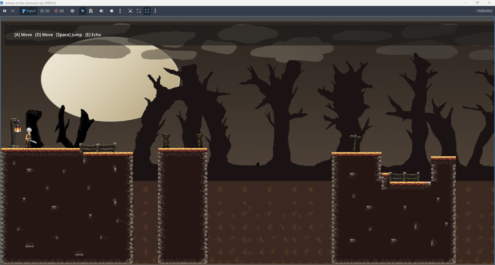
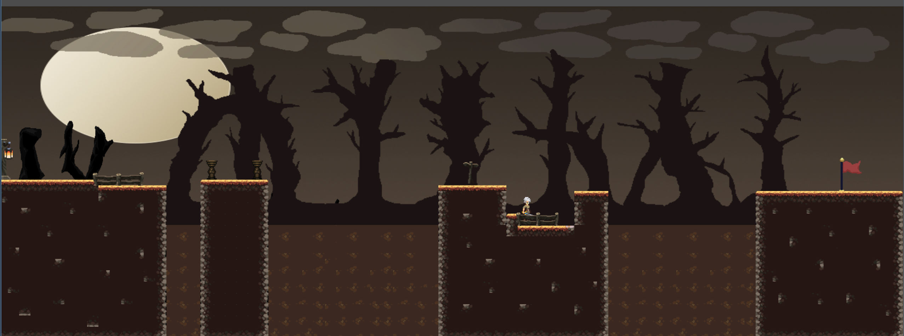
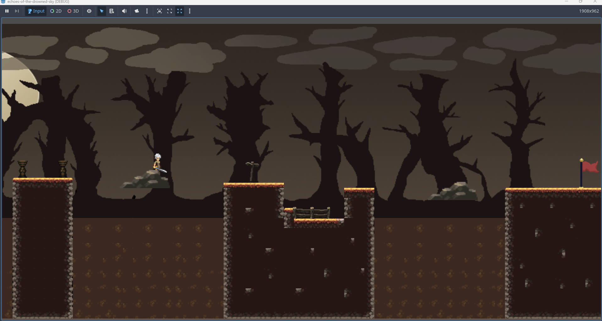
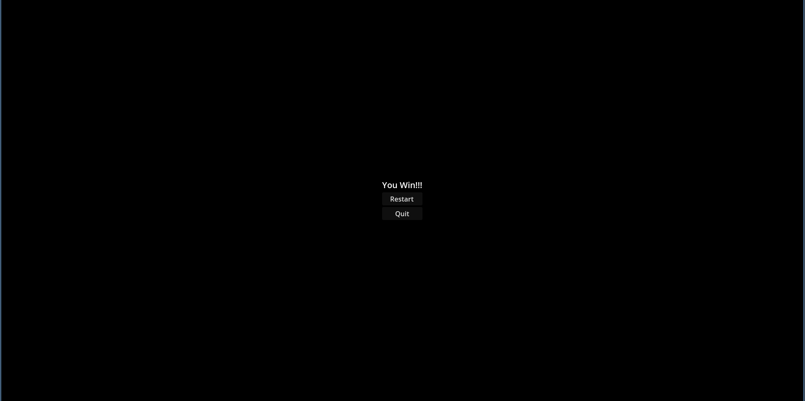

# Echoes of the Drowned Sky

Echoes of the Drowned Sky is a small 2D platformer developed using the Godot Engine.

The main gameplay idea is an **Echo ability** that allows the player to create temporary platforms in mid-air in order to cross gaps and reach higher areas.

This repository contains the **alpha version** of the project which demonstrates the core gameplay mechanic and a simple playable level.

## Controls

A / D – Move left and right  
Space – Jump  
E – Create Echo platform

## Current Features (Alpha)

The current alpha version includes the following systems:

- Basic player movement
- Jump mechanic
- Echo platform ability
- A simple Level 1 layout
- Kill zone that resets the player when falling
- Win condition using a goal flag
- Small tutorial UI showing the controls

The purpose of this version is mainly to demonstrate the gameplay mechanic rather than a finished game.

## Gameplay Screenshots

## Gameplay Video

YouTube gameplay video:

https://youtu.be/KQkmG7EHj68

## Development Notes

The project was developed using **Godot Engine 4** and written mainly in **GDScript**.

The focus of the alpha stage was implementing the core mechanic and ensuring the gameplay loop works correctly.

Future development may include:
- additional levels
- improved visual effects
- sound effects and music
- more advanced platform mechanics

---

## AI Usage

An AI assistant (ChatGPT) was occasionally used during development as a support tool for:

- explaining some Godot features
- debugging small scripting issues
- clarifying Git and project setup questions

All gameplay design decisions and implementation were completed by the developer.